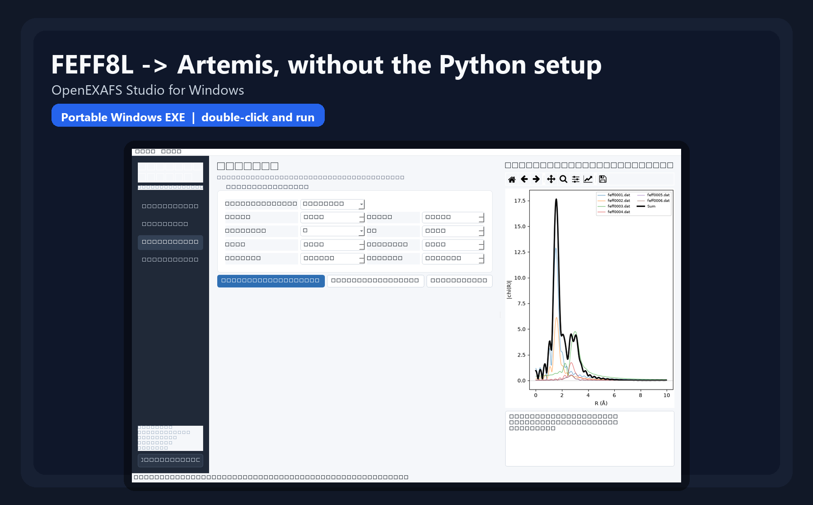

# OpenEXAFS Studio

**Structure -> Feff8L -> FEFF8 scattering paths -> Artemis**

OpenEXAFS Studio is a focused Python GUI for generating Feff8L EXAFS scattering paths with XrayLarch,
inspecting and previewing those paths, and exporting the original FEFF8 calculation files for use in
Artemis.

The project intentionally does **not** implement its own EXAFS fitting page. Quantitative fitting is
left to Artemis or another dedicated EXAFS fitting environment.

## Windows EXE

Prefer not to install Python? A portable Windows build is generated automatically from the repository.

[**Download the latest Windows EXE package from Releases**](https://github.com/sebalaghi/OpenEXAFS-Studio/releases/latest)

Download `OpenEXAFS-Studio-Windows-x64.zip`, extract it, and double-click:

```text
OpenEXAFS-Studio.exe
```

No separate Python installation is required. The portable package also includes the Artemis compatibility patch.




## What it does

- Load CIF and other crystal structures supported by Larch/pymatgen
- Select absorber, crystallographic site, K/L edge, and cluster radius
- Generate editable FEFF8-style `feff.inp`
- Run Feff8L from XrayLarch
- Browse `feffNNNN.dat` paths with SS/MS filtering
- Preview chi(k), k-weighted chi(k), |chi(R)|, Re chi(R), and Im chi(R)
- Export preview data and figures
- Export an **Artemis FEFF8 folder** or **Artemis FEFF8 ZIP**
- Preserve the original Feff8L path files without converting them to FEFF6

## Artemis workflow

After running Feff8L, use the **Artemis export** page.

The export contains:

```text
feff.inp
paths.dat        if generated
files.dat        if generated
list.dat         if generated
phase.bin        if generated
feff0001.dat
feff0002.dat
...
ARTEMIS_IMPORT.txt
```

### First-time Artemis setup on Windows

This is currently tested with **Artemis / Demeter 0.9.26**.

Artemis already contains an external-FEFF import mechanism, but in the standard 0.9.26 GUI it is not exposed for this FEFF8L workflow. OpenEXAFS Studio therefore includes a small compatibility patch:

```powershell
powershell -ExecutionPolicy Bypass -File .\ENABLE_ARTEMIS_EXTERNAL_IMPORT.ps1
```

Before running it:

1. Close Artemis completely.
2. Open PowerShell in the OpenEXAFS Studio repository folder.
3. Run the command above.
4. Restart Artemis.

The script creates timestamped backups of every Artemis/Demeter file it modifies.

### Importing a FEFF8L calculation into Artemis

1. In OpenEXAFS Studio, run Feff8L normally.
2. Open **Artemis export**.
3. Choose **Export Artemis folder** or **Export Artemis ZIP**.
4. If you exported a ZIP, extract it to a normal local folder.
5. Start Artemis.
6. Choose **File -> Import... -> an external Feff calculation**.
7. Select the exported **`feff.inp`**.
8. Accept Artemis' warning about importing an external FEFF calculation.
9. Open the **Paths** tab. The table should be populated from the existing FEFF8L `feffNNNN.dat` files.
10. Select one or more paths and use them in Artemis as usual.

### Important

Do **not** use:

- **File -> Import... -> a feffit.inp file**
- the normal Artemis **Run Feff** button for this imported calculation

Those routes are not the FEFF8L handoff described here.

The intended workflow is:

```text
Structure
  -> OpenEXAFS Studio
  -> Feff8L
  -> original feffNNNN.dat files
  -> Artemis external FEFF import
  -> Artemis fitting
```

OpenEXAFS Studio does not convert the paths to FEFF6. The numerical scattering-path files remain the original Feff8L outputs.

### If the Paths table is empty

Check the following:

- You used **an external Feff calculation**, not **a feff.inp file**.
- You ran the latest `ENABLE_ARTEMIS_EXTERNAL_IMPORT.ps1` after updating the repository.
- Artemis was closed while the patch was applied.
- The exported folder still contains the original `feffNNNN.dat` files.
- You restarted Artemis after applying the patch.

If needed, update OpenEXAFS Studio and re-run the patch:

```powershell
git pull
pip install -e .
powershell -ExecutionPolicy Bypass -File .\ENABLE_ARTEMIS_EXTERNAL_IMPORT.ps1
```

### If Artemis freezes when plotting a raw path

Older Artemis 0.9.26 code may try to regenerate an external path instead of reading the existing FEFF8L file. The current OpenEXAFS Studio patch modifies this behavior so Artemis plots directly from the original `feffNNNN.dat`.

If plotting still locks:

1. Close Artemis.
2. Run `git pull`.
3. Re-run `ENABLE_ARTEMIS_EXTERNAL_IMPORT.ps1`.
4. Restart Artemis.
5. Import the calculation again.
6. Test plotting with a single path first.

Bruce Ravel has documented the use of externally generated `feffNNNN.dat` files in Demeter by explicitly supplying the external file and folder.

## Quick start on Windows

```powershell
git clone https://github.com/sebalaghi/OpenEXAFS-Studio.git
cd OpenEXAFS-Studio

python -m venv .venv
.\.venv\Scripts\Activate.ps1

python -m pip install --upgrade pip
pip install -e .

python launch.py
```

The repository also includes `INSTALL_AND_RUN.bat`, `RUN_GUI.bat`, and diagnostic helpers.

## Scientific scope

Feff8L is used here for EXAFS path calculations. OpenEXAFS Studio does not claim to replace full
FEFF9 XANES calculations.

## Project structure

```text
openexafs_studio/core.py          Feff8L engine and Artemis export
openexafs_studio/main_window.py   PySide6 desktop GUI
streamlit_app.py                  browser edition
site/                             GitHub Pages landing page
examples/                         sample structures
docs/                             deployment and scientific notes
```

## Citation

Please cite XrayLarch and the FEFF methodology used in your scientific work. Software authorship is
listed in `CITATION.cff`.

## License

OpenEXAFS Studio application code is MIT licensed. XrayLarch, Feff8L, pymatgen, Qt/PySide, and
other dependencies retain their upstream licenses.
